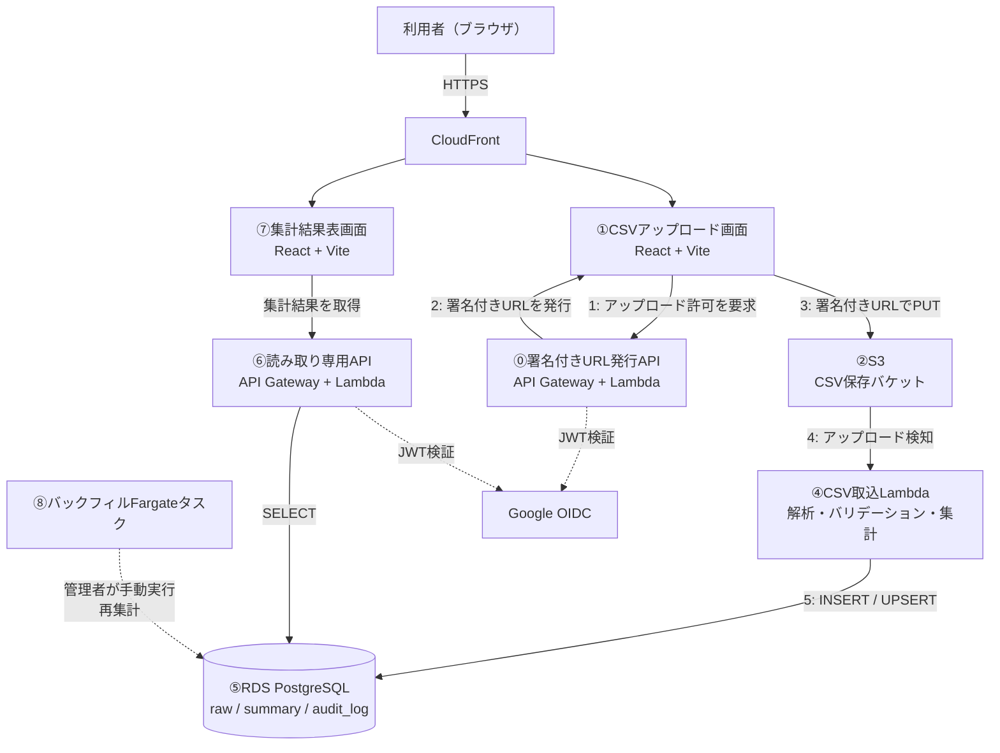

# コストデータ取込・分析システム（CSV Data Pipeline）

CSVをアップロードするだけで、解析・DB取り込み・集計までを自動化するシステム。実務で経験したCSV取込・データ移行パイプラインの構成を、AWSインフラ設計から自分の裁量で作り直したポートフォリオ。

## これは何のためのプロジェクトか

これまで実務では、他部署から届く費用（コスト）データのCSVを、担当者が手作業でExcelに転記・集計していた。転記ミス・属人化・集計のやり直しといった課題を、「アップロードするだけで自動的に集計結果が最新化される」仕組みに置き換えるとどうなるかを、個人開発として一から設計・構築した。

もう1つのポートフォリオ [career-support-app](../career-support-app)（学習記録PF）ではバックエンド・フロントエンドの実装力を、このプロジェクトでは **AWSインフラ設計・データパイプライン構築** に力点を置いている。

| | career-support-app（学習記録PF） | 本プロジェクト（ETL PF） |
|---|---|---|
| 証明する力 | バックエンド・フロントエンドの実装力 | AWSインフラ設計・データパイプライン構築 |
| アーキテクチャ | ECS Fargate（常時起動のWebアプリ） | イベント駆動（S3→Lambda）＋バックフィル用Fargate |
| 認証方式 | 自前JWT | OIDC（Google） |
| 実務との関係 | ポートフォリオとして新規設計 | 実務で経験した構成の再現 |

---

## アーキテクチャ



- 詳細な設計判断・比較検討した代替案（Athena・Cognito・Fargate等の不採用理由）は [docs/architecture.md](./docs/architecture.md)
- ネットワーク設計（VPC・サブネット・SG）は [docs/network.md](./docs/network.md)
- セキュリティレビューの指摘一覧・対応方針は [docs/security.md](./docs/security.md)

---

## 使用技術

| 領域 | 技術 |
|---|---|
| フロントエンド | React 19 + TypeScript + Vite、TanStack Query、axios、Tailwind CSS v4、shadcn/ui、react-router-dom |
| バックエンド | Python（Lambda 3本 + Fargateタスク）、psycopg2 |
| データベース | Amazon RDS for PostgreSQL |
| 認証 | OIDC（Googleでログイン）、Lambda AuthorizerによるJWT自前検証（JWKS） |
| インフラ | API Gateway（HTTP API）、S3、CloudFront、ECS Fargate + ECR、Secrets Manager、IAM |
| 配信 | S3 + CloudFront（静的ホスティング） |

新しく学んだのは実質 **Lambda（イベント駆動処理）・API Gateway・OIDC認証（Google・自前トークン検証）・VPC設計** の4つ。他はもう1つのポートフォリオで学んだ内容の応用。

---

## 設計上のポイント（抜粋）

- **署名付きURLの保存先パスはクライアントに送らせない**：ログイン中ユーザーのJWTから`sub`を取り出し、サーバー側（Lambda）でS3キーを組み立てる。クライアントが指定したパスをそのまま信用すると、他人のファイルを上書き・閲覧できてしまうため（[docs/architecture.md](./docs/architecture.md) 4-2）
- **S3のアップロードイベントは「最低1回配信」を前提に、べき等性を設計する**：`upload_audit_log`テーブルの`file_key`にUNIQUE制約を張り、`processing`状態での予約INSERTを「一番最初に成功した呼び出しだけが処理を進めてよい」関所にすることで、重複配信による二重集計を防いでいる（[docs/database.md](./docs/database.md) 2-3）
- **Cognitoを使わず、GoogleのIDトークンを自前のLambda AuthorizerでJWKS検証する**：個人のGoogleアカウント1つでログインできればよいという要件に対し、Cognitoの複数IdP対応・ユーザー管理UI等は過剰装備と判断。OIDCの検証ロジック自体を理解する目的も兼ねて自前実装にした（[docs/architecture.md](./docs/architecture.md) 7-4）
- **集計はアップロード時に1回だけ行い、画面はRDSを読むだけにする**：Amazon Athenaで都度スキャンする案も検討したが、画面を開くたびに課金・レイテンシが発生する構成は要件（集計結果の一覧表示）に対して過剰と判断した（[docs/architecture.md](./docs/architecture.md) 7-1）
- **セキュリティレビューを実装前に自分で実施**：署名付きURLのパス偽装・SQLインジェクション・認証情報の管理方法など8件の指摘を洗い出し、設計に反映してから実装に着手した（[docs/security.md](./docs/security.md)）

---

## 現在の実装状況

| 領域 | 状況 |
|---|---|
| バックエンド（Lambda/Fargateのコアロジック） | 実装済み。ユニットテストあり |
| フロントエンド（3画面） | 実装済み |
| AWSインフラ（公開版） | コンソールで構築済み。CSVアップロード→DB反映→集計表示の一連の動作を確認済み |
| Terraform化 | 未着手（現時点はAWSコンソールでの手動構築） |
| バックフィル用インフラ（ECS Fargate） | Pythonコード・ECR・タスク定義まで作成済み。ECSサービス・起動トリガーは今後整備予定 |

---

## ディレクトリ構成

```
csv-data-pipeline/
  backend/       # Lambda（署名付きURL発行・CSV取込・集計API）、Fargate（バックフィル）
  frontend/      # React + Vite（ログイン・アップロード・集計結果表の3画面）
  docs/          # このリポジトリの設計ドキュメント（要件定義・アーキテクチャ・DB・API・セキュリティ）
```

- `backend/`の動かし方は [backend/README.md](./backend/README.md)
- `frontend/`の動かし方は [frontend/README.md](./frontend/README.md)

## ドキュメント一覧

| ドキュメント | 内容 |
|---|---|
| [docs/requirements.md](./docs/requirements.md) | 要件定義書 |
| [docs/architecture.md](./docs/architecture.md) | アーキテクチャ設計書（構成・セキュリティ設計・技術選定の比較検討） |
| [docs/database.md](./docs/database.md) | データベース設計（DDL・UPSERT・べき等性） |
| [docs/api.md](./docs/api.md) | API仕様書 |
| [docs/csv-format.md](./docs/csv-format.md) | 取込CSVフォーマット仕様 |
| [docs/network.md](./docs/network.md) | ネットワーク設計（VPC・サブネット・SG） |
| [docs/security.md](./docs/security.md) | セキュリティレビュー記録 |
