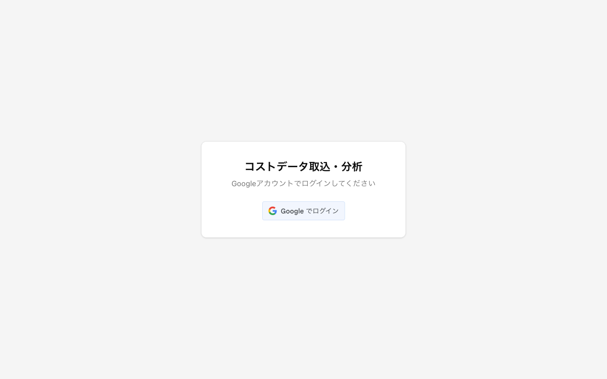
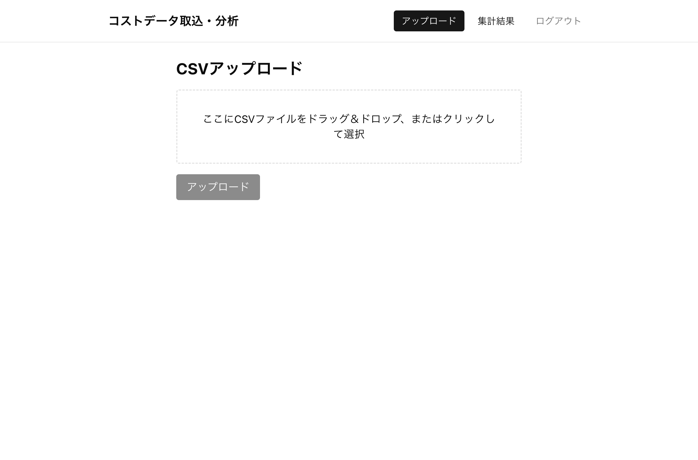
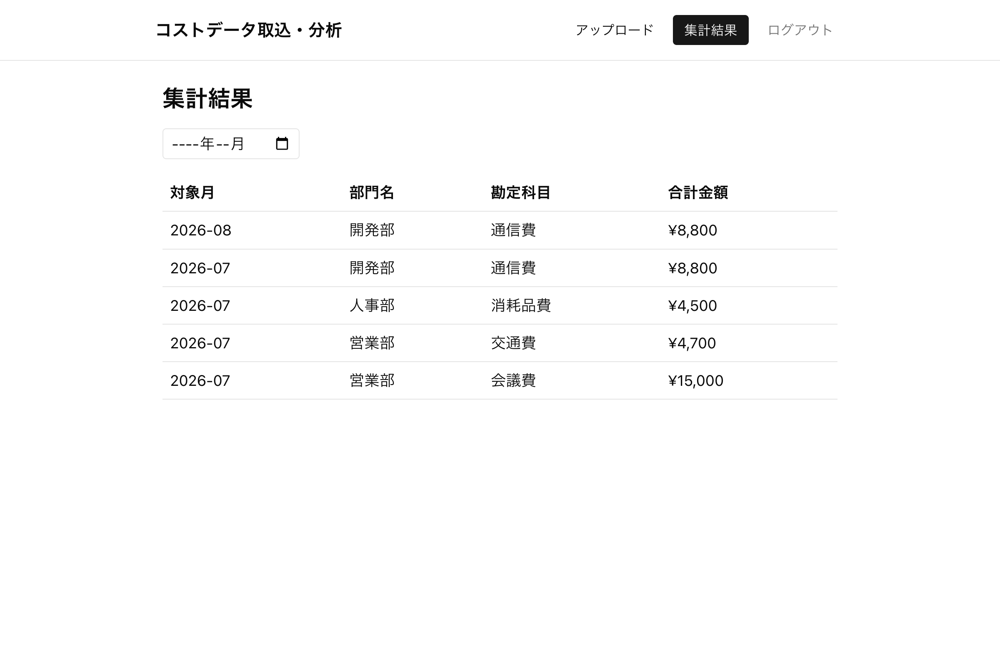
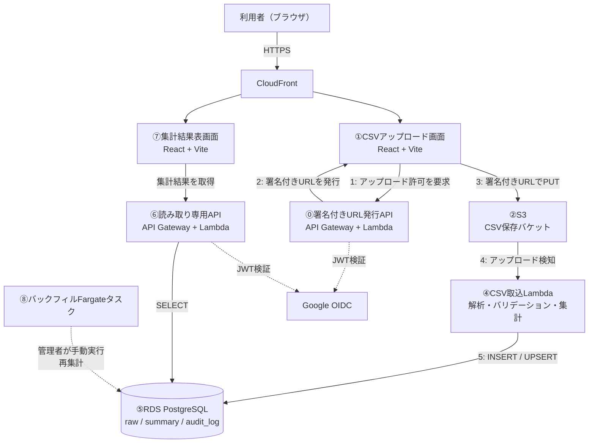

# コストデータ取込・分析システム（CSV Data Pipeline）

CSVをアップロードするだけで、解析・DB取り込み・集計までを自動化するシステム。実務で経験したCSV取込・データ移行パイプラインの構成を、AWSインフラ設計から自分の裁量で作り直した個人開発（転職・学習目的のポートフォリオ）。

🔗 **デモ：[https://csv.okuyamat.click/](https://csv.okuyamat.click/)**（今回はOIDC認証の学習を目的としてGoogleアカウントでのログインを必須にしているため、ログインせずに画面だけ見たい場合は下のスクリーンショットをご覧いただくことを推奨します。実際に試す場合はアップロード画面からサンプルCSVをダウンロードできます）

| ログイン | アップロード | 集計結果 |
|---|---|---|
|  |  |  |

---

## これは何のためのプロジェクトか

### このPFを作った理由

- 以前の実務で、CSVデータの入稿〜集計までを扱うシステムに携わっていた
- dev環境は先輩エンジニアが構築、本番（prod）環境は自分が担当
  - 当時はエンジニア１年目だった。構成を一から設計できる実力はまだ無く、先輩が作ったdev環境の構成をなぞって作る形になった
- このプロジェクトは、その「構成そのものを一から考える」部分を、今の自分でもう一度作り直したもの
- 実務システムの再現ではなく、**当時十分にできなかったことへの再挑戦**という位置づけ

### 実務での経験（規模感）

- 支出分析サービスチームでサブリーダーをしていた。顧客企業から預かったExcelデータをCSV化・入稿する業務フローがあり、その入稿システムに関しては実質的にリーダーとして担当。開発・障害調査に加え、作業者（ビジネス職・エンジニアチーム）への運用フロー説明や入稿作業自体の進捗管理も行った。
- 150社以上、1社あたり数千〜数百万件規模のデータを取込
- AWS基盤は、dev環境を先輩エンジニアが構築、本番（prod）環境は自分が担当（dev環境の構成をなぞる形）。加えて以下も担当
  - 入稿データ・集計データマートへの登録SQLの実装
  - CSVファイルのバリデーション処理
  - Chatworkへの処理結果通知
  - データマートの再設計（当初は生テーブルのみでパフォーマンス問題が発生したため）

### 今回あえて取り組んだこと

- AWS構成を自分で設計（VPC・SG・RDS・Lambda等）
- Terraformでのインフラのコード化
- Google OIDCによる認証をゼロから実装
- イベント駆動（S3→Lambda）の取込パイプライン構築

もう1つのポートフォリオ [career-support-app](../career-support-app)（学習記録PF）ではバックエンド・フロントエンドの実装力を、このプロジェクトでは **AWSインフラ設計・データパイプライン構築** に力点を置いている。

| | career-support-app（学習記録PF） | 本プロジェクト（ETL PF） |
|---|---|---|
| 証明する力 | バックエンド・フロントエンドの実装力 | AWSインフラ設計・データパイプライン構築 |
| アーキテクチャ | ECS Fargate（常時起動のWebアプリ） | イベント駆動（S3→Lambda）＋バックフィル用Fargate |
| 認証方式 | 自前JWT | OIDC（Google） |
| 実務との関係 | ポートフォリオとして新規設計 | 実務で扱った仕組みを、当時できなかった部分まで一から作り直したもの |

---

## アーキテクチャ


```mermaid
flowchart TD
    User["利用者（ブラウザ）"]
    Upload["①CSVアップロード画面<br/>React + Vite"]
    Summary["⑦集計結果表画面<br/>React + Vite"]
    CF["CloudFront"]
    PresignAPI["⓪署名付きURL発行API<br/>API Gateway + Lambda"]
    S3["②S3<br/>CSV保存バケット"]
    IngestLambda["④CSV取込Lambda<br/>解析・バリデーション・集計"]
    RDS[("⑤RDS PostgreSQL<br/>raw / summary / audit_log")]
    SummaryAPI["⑥読み取り専用API<br/>API Gateway + Lambda"]
    Backfill["⑧バックフィルFargateタスク"]
    Google["Google OIDC"]

    User -->|HTTPS| CF --> Upload
    CF --> Summary
    Upload -->|1: アップロード許可を要求| PresignAPI
    PresignAPI -->|2: 署名付きURLを発行| Upload
    Upload -->|3: 署名付きURLでPUT| S3
    S3 -->|4: アップロード検知| IngestLambda
    IngestLambda -->|5: INSERT / UPSERT| RDS
    Summary -->|集計結果を取得| SummaryAPI
    SummaryAPI -->|SELECT| RDS
    PresignAPI -. JWT検証 .-> Google
    SummaryAPI -. JWT検証 .-> Google
    Backfill -.->|管理者が手動実行<br/>再集計| RDS
```

- 詳細な設計判断・比較検討した代替案（Athena・Cognito・Fargate等の不採用理由）は [docs/architecture.md](./docs/architecture.md)
- ネットワーク設計（VPC・サブネット・SG）は [docs/network.md](./docs/network.md)
- セキュリティレビューの指摘一覧・対応方針は [docs/security.md](./docs/security.md)

---

## 使用技術

| 領域 | 技術 |
|---|---|
| フロントエンド | React 19 + TypeScript + Vite、TanStack Query、axios、Tailwind CSS v4、shadcn/ui、react-router-dom |
| バックエンド | Python（Lambda 3本 + Fargateタスク）、psycopg2 |
| データベース | Amazon RDS for PostgreSQL |
| 認証 | OIDC（Googleでログイン）、Lambda AuthorizerによるJWT自前検証（JWKS） |
| インフラ | API Gateway（HTTP API）、S3、CloudFront、ECS Fargate + ECR、Secrets Manager、IAM |
| 配信 | S3 + CloudFront（静的ホスティング） |

新しく学んだのは実質 **Lambda（イベント駆動処理）・API Gateway・OIDC認証（Google・自前トークン検証）・VPC設計** の4つ。他はもう1つのポートフォリオで学んだ内容の応用。

---

## データベース設計

| テーブル | 役割 |
|---|---|
| `raw_expenses` | CSVの各行をほぼそのまま保存する生データ |
| `summary_expenses` | 月・部門・勘定科目単位で金額を合計した集計データ |
| `upload_audit_log` | 誰が・いつ・どのファイルをアップロードし、成功/失敗したかの記録 |

<details>
<summary>各テーブルのカラム定義</summary>

**`raw_expenses`**

| 物理名 | 型 | 説明 |
|---|---|---|
| `id` | BIGSERIAL | PK |
| `user_sub` | VARCHAR(255) | GoogleのIDトークンに含まれる`sub` |
| `source_file_key` | VARCHAR(1024) | 元CSVのS3オブジェクトキー |
| `usage_date` | DATE | 経費が発生した日 |
| `department_code` / `department_name` | VARCHAR | 部門コード・部門名 |
| `account_category` | VARCHAR(100) | 勘定科目 |
| `amount` | INTEGER | 支出額（`CHECK (amount >= 0)`） |
| `vendor` / `description` | VARCHAR / TEXT | 取引先・摘要（NULL可） |
| `uploaded_at` | TIMESTAMPTZ | DB登録日時 |

**`summary_expenses`**

| 物理名 | 型 | 説明 |
|---|---|---|
| `id` | BIGSERIAL | PK |
| `user_sub` / `usage_month` / `department_code` / `account_category` | - | 複合UNIQUE制約（この4つの組み合わせで1行に集約） |
| `department_name` | VARCHAR(100) | 部門名 |
| `total_amount` | INTEGER | 合計金額 |
| `updated_at` | TIMESTAMPTZ | 最終更新日時 |

**`upload_audit_log`**

| 物理名 | 型 | 説明 |
|---|---|---|
| `id` | BIGSERIAL | PK |
| `user_sub` | VARCHAR(255) | アップロードした人 |
| `file_key` | VARCHAR(1024) | UNIQUE。同一ファイルの重複INSERTを防ぐべき等性の関所 |
| `row_count` | INTEGER | 取込行数（`processing`中・失敗時はNULL） |
| `status` | VARCHAR(20) | `processing` / `success` / `failed` |
| `error_message` | TEXT | 失敗時のエラー内容 |
| `processed_at` | TIMESTAMPTZ | 予約・確定時に更新される日時 |

全DDL・UPSERT文・バックフィル時のSQLは [docs/database.md](./docs/database.md) を参照。

</details>

---

## API設計

| API | メソッド・パス | 認証 | 概要 |
|---|---|---|---|
| 署名付きURL発行API | `POST /upload-url` | 必須 | CSVアップロード用のS3署名付きURLを発行する |
| 読み取り専用API | `GET /summary` | 必須 | 集計結果を取得する（`month`パラメータで絞り込み可） |

<details>
<summary>リクエスト・レスポンス例</summary>

**`POST /upload-url`**

リクエストボディ無し（保存先パスはクライアントから送らず、トークンの`sub`からLambda側で組み立てる）。

```json
// 200 OK
{
  "url": "https://cost-csv-bucket.s3.ap-northeast-1.amazonaws.com/uploads/...（署名付き）",
  "key": "uploads/google-oauth2|12345/20260720T120000Z_costs.csv",
  "expiresIn": 300
}
```

**`GET /summary?month=2026-07`**

```json
// 200 OK
{
  "items": [
    {
      "usageMonth": "2026-07",
      "departmentCode": "SALES",
      "departmentName": "営業部",
      "accountCategory": "交通費",
      "totalAmount": 4700
    }
  ]
}
```

**共通エラー形式**

```json
{ "error": { "code": "UNAUTHORIZED", "message": "..." } }
```

| コード | 意味 | HTTPステータス |
|---|---|---|
| `UNAUTHORIZED` | 認証トークンが無い、または無効 | 401 |
| `VALIDATION_ERROR` | リクエストの内容が不正 | 400 |
| `INTERNAL_ERROR` | サーバー内部エラー | 500 |

詳細は [docs/api.md](./docs/api.md) を参照。

</details>

---

## 設計で意識したこと

- **署名付きURLの保存先パスはクライアントに送らせない**
  - ログイン中ユーザーのJWTから`sub`を取り出し、サーバー側（Lambda）でS3キーを組み立てる
  - クライアントが指定したパスをそのまま信用すると、他人のファイルを上書き・閲覧できてしまうため
  - 詳細：[docs/architecture.md 4-2](./docs/architecture.md)
- **S3のアップロードイベントは「最低1回配信」を前提に、べき等性を設計する**
  - `upload_audit_log`テーブルの`file_key`にUNIQUE制約を張る
  - `processing`状態での予約INSERTを「一番最初に成功した呼び出しだけが処理を進めてよい」関所にする
  - これにより、重複配信による二重集計を防いでいる
  - 詳細：[docs/database.md 2-3](./docs/database.md)
- **Cognitoを使わず、GoogleのIDトークンをLambda AuthorizerでJWKS検証する**
  - OIDCの検証ロジック自体を自分で実装して理解したかったため、Cognitoに任せず自前実装にした
  - 詳細：[docs/architecture.md 7-4](./docs/architecture.md)
- **JWT検証をLambda Authorizer（VPC外）に切り出す**
  - RDS接続用のsummary用LambdaはVPC内に置く必要があるが、VPC内からはGoogleのJWKSエンドポイント（インターネット）に到達できずタイムアウトする
  - NATゲートウェイを置けばVPC内からでも直接到達できるが、本プロジェクトは時間課金・データ処理課金が発生するNATゲートウェイを置かない方針（詳細：[docs/network.md](./docs/network.md)）のため採用しなかった。GoogleのJWKSはAWSサービスではなくVPCエンドポイントの対象にもできない
  - 検証だけを担当するVPC外のLambda Authorizerを手前に置くことで、NATゲートウェイ無しでも解消した
- **集計はアップロード時に1回だけ行い、画面はRDSを読むだけにする**
  - Amazon Athenaで都度スキャンする案も検討した
  - 画面を開くたびに課金・レイテンシが発生する構成は要件（集計結果の一覧表示）に対して過剰と判断した
  - 詳細：[docs/architecture.md 7-1](./docs/architecture.md)
- **バックフィル（過去データの再集計）はFargateで作る**
  - このPFの実際のデータ量でLambdaの実行時間上限（15分）に達することはほぼ無いが、時間制限の無いバッチ処理の実装も試したかったため、Fargateにした
  - 詳細：[docs/architecture.md 6章](./docs/architecture.md)
- **セキュリティレビューを実装前に自分で実施**
  - 署名付きURLのパス偽装・SQLインジェクション・認証情報の管理方法など8件の指摘を洗い出した
  - 設計に反映してから実装に着手した
  - 詳細：[docs/security.md](./docs/security.md)

---

## ディレクトリ構成

```
csv-data-pipeline/
  backend/       # Lambda（署名付きURL発行・CSV取込・集計API）、Fargate（バックフィル）
  frontend/      # React + Vite（ログイン・アップロード・集計結果表の3画面）
  docs/          # このリポジトリの設計ドキュメント（要件定義・アーキテクチャ・DB・API・セキュリティ）
```

- `backend/`の動かし方は [backend/README.md](./backend/README.md)
- `frontend/`の動かし方は [frontend/README.md](./frontend/README.md)

---

## 今後試してみたいこと

現在は、S3にアップロードしたCSVをLambdaで取り込み、RDS（PostgreSQL）に保存・集計する構成にしている。

よりモダンなデータ基盤の方法も試してみたいと考えている。実装自体はすぐにできるとしても、それぞれの特徴や使い分けをきちんと理解した上で選べるようになりたいため、時間を取って取り組む予定。

- **AthenaによるS3上のデータの直接参照**
  RDSへ取り込まずにS3上のデータをSQLで参照し、現在の構成との違いを比較する。
- **CSVからParquetへの変換**
  列指向フォーマットにすることで、Athenaでのスキャン量やクエリ性能がどの程度変わるか確認する。
- **Apache Icebergを使ったデータ管理**
  S3上のデータを単なるファイルではなくテーブルとして管理し、更新やスキーマ変更、スナップショットなどを試す。
- **RDSとS3をまたいだデータ参照**
  Federated Queryなどを使い、データを1か所に集約せずに複数のデータソースを扱う方法も試してみる。

最終的には、現在のRDS中心の構成と比較しながら、データ量や利用目的によってどの構成を選ぶのがよいか、自分なりに整理したい。

## ドキュメント一覧

| ドキュメント | 内容 |
|---|---|
| [docs/requirements.md](./docs/requirements.md) | 要件定義書 |
| [docs/architecture.md](./docs/architecture.md) | アーキテクチャ設計書（構成・セキュリティ設計・技術選定の比較検討） |
| [docs/database.md](./docs/database.md) | データベース設計（DDL・UPSERT・べき等性） |
| [docs/api.md](./docs/api.md) | API仕様書 |
| [docs/csv-format.md](./docs/csv-format.md) | 取込CSVフォーマット仕様 |
| [docs/network.md](./docs/network.md) | ネットワーク設計（VPC・サブネット・SG） |
| [docs/security.md](./docs/security.md) | セキュリティレビュー記録 |
| [docs/deploy.md](./docs/deploy.md) | デプロイ手順（フロントエンド・Lambda・インフラ） |
