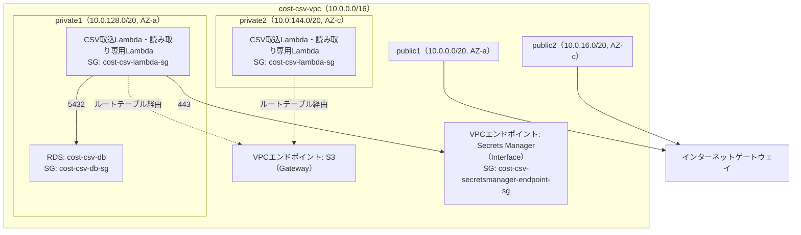

# ネットワーク設計（VPC・サブネット・ルートテーブル・SG・エンドポイント）

- 前提：全体構成は [architecture.md](./architecture.md)

---

## 1. 全体図

- LambdaはRDS（パブリックアクセスなし）と通信するため、VPCのプライベートサブネットにENI（Elastic Network Interface）を持つ構成にしている
- NATゲートウェイは配置していない。Lambdaが必要とする外部通信（S3・Secrets Manager・ECR・CloudWatch Logs）はすべてVPCエンドポイント経由にすることで、NATゲートウェイのコストを避けている

---

## 2. サブネット構成

VPC全体は`10.0.0.0/16`（65,536アドレス）。各サブネットは`/20`（4,096アドレス）で、パブリック用・プライベート用の間に予備のCIDR帯を空けて割り当てている（将来サブネットを追加する際、既存の番号を振り直さずに済むようにするため）。

| サブネット | CIDR | AZ | 公開/非公開 | 配置するリソース |
|---|---|---|---|---|
| public1 | `10.0.0.0/20` | ap-northeast-1a | パブリック | （フロントエンドはCloudFront配信のため未使用） |
| public2 | `10.0.16.0/20` | ap-northeast-1c | パブリック | 同上 |
| private1 | `10.0.128.0/20` | ap-northeast-1a | プライベート | RDS、Lambda（ENI） |
| private2 | `10.0.144.0/20` | ap-northeast-1c | プライベート | Lambda（ENI） |

---

## 3. ルートテーブル

| 用途 | ルート | 関連付けるサブネット |
|---|---|---|
| パブリック用（2サブネット共用） | `0.0.0.0/0`→インターネットゲートウェイ | public1・public2 |
| private1専用 | `10.0.0.0/16`宛→ローカル、S3宛→S3用VPCエンドポイント（インターネットへの経路は無い） | private1 |
| private2専用 | `10.0.0.0/16`宛→ローカル、S3宛→S3用VPCエンドポイント（インターネットへの経路は無い） | private2 |

---

## 4. セキュリティグループ

| 名前 | 用途 | インバウンド |
|---|---|---|
| `cost-csv-db-sg` | RDS用 | `cost-csv-lambda-sg`から5432番 |
| `cost-csv-lambda-sg` | Lambda用 | なし（空） |
| `cost-csv-secretsmanager-endpoint-sg` | Secrets Manager等のInterfaceエンドポイント用 | `cost-csv-lambda-sg`から443番 |

- インバウンドで「送信元：SG」を指定できるのは、AWSが判定の瞬間に「今このSGが付いているENIはどれか」を動的に解決して許可・拒否を決める仕組みのため。LambdaのENIが再作成されてプライベートIPが変わっても、同じSGさえ付いていればルールを書き直す必要がない
- `cost-csv-lambda-sg`のインバウンドが空でも問題ないのは、SGがステートフル（stateful）なため。アウトバウンドで許可した通信の「戻り」は、インバウンドルールが無くても自動的に通る

---

## 5. VPCエンドポイント

| サービス | タイプ | 用途 |
|---|---|---|
| S3 | Gateway | Lambdaからのraw CSV取得等 |
| Secrets Manager | Interface | RDS認証情報の取得 |
| ECR API / ECR Docker | Interface | バックフィルFargateタスクのイメージpull |
| CloudWatch Logs | Interface | Fargateタスクのログ送信 |

- NATゲートウェイを置かない設計のため、プライベートサブネットから呼び出すAWSサービスにはそれぞれ専用のVPCエンドポイントが必要になる（ECR・CloudWatch LogsはFargateバックフィルタスクの実行過程で必要に気づいて追加）
